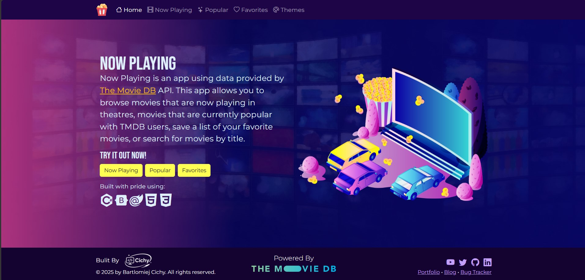

# 🍿 Now Playing

A movie browser built with **C# and Blazor WebAssembly**. It uses data from [The Movie DB (TMDB)](https://www.themoviedb.org/) API. You can browse films that are in theatres, see what is popular, search by title, open a full movie page with a trailer and cast, and keep your own list of favorites.

**[🔗 Live demo](https://nowplayingsite.netlify.app/)**




---

## About the project

This is a portfolio project. I built it to show that I can create a complete client-side web application: consuming a third-party REST API, structuring a Blazor app into components and services, persisting user data in the browser, and deploying it without exposing secrets.

## Features

- **Now Playing** – movies currently in theatres (US region).
- **Popular** – movies currently popular with TMDB users.
- **Search** – find movies by title. The query is kept in the URL (`/search?query=...`), so results can be linked to.
- **Movie details** – poster and backdrop, tagline, release date, runtime, genres, overview, user score, and a **YouTube trailer** in a modal window.
- **Top billed cast** – a horizontally scrolling actor list with its own custom-built swiper component.
- **Favorites** – add and remove movies from any list. They are stored in the browser's `localStorage`, so there is no account or backend to set up.
- **11 colour themes** – switch the look of the whole app on the *Themes* page (built on CSS custom properties).
- **Responsive layout** – Bootstrap grid from one column on phones up to four on wide screens.
- **Graceful fallbacks** – placeholder images for missing posters, backdrops and profile photos, plus loading and error states on every page.

## Tech stack

| Area | Technology |
| --- | --- |
| Framework | Blazor WebAssembly, .NET 9 |
| Language | C# 13 (nullable reference types enabled), a little JavaScript |
| UI | Bootstrap 5.3, Bootstrap Icons, scoped CSS per component, Google Fonts (Bebas Neue, Montserrat) |
| Data | TMDB REST API (`HttpClient` + `System.Net.Http.Json`) |
| Persistence | Browser `localStorage` through JS interop |
| Hosting | Netlify, with a Netlify Edge Function (Deno) as an API proxy |

## How it works

```
Browser (Blazor WASM)
   │
   ├── TMDBService ───────────► TMDB API
   │       │   (local development: direct call with a Bearer token)
   │       │
   │       └── /TMDB/* ──► Netlify Edge Function ──► TMDB API
   │           (production: the token stays on the server)
   │
   └── FavoritesService ──► localStorage
```

A few design decisions worth pointing out:

- **The API key never ships to production.** In the deployed app, `TMDBService` calls `/TMDB/*`. A Netlify Edge Function ([`netlify/edge-functions/TMDB.js`](netlify/edge-functions/TMDB.js)) adds the `Authorization` header on the server and forwards the request to TMDB. Because a WebAssembly app is fully visible to the user, this is the reason for the proxy.
- **One service picks its mode from configuration.** If `TmdbAccessKey` is present in the app configuration, the service talks to TMDB directly (local development). Otherwise it uses the proxy route (production).
- **Dependency injection.** `TMDBService` and `FavoritesService` are registered as scoped services in [`Program.cs`](Program.cs) and injected into the pages and components that need them.
- **Typed models.** API responses are deserialized into C# models with a `snake_case` naming policy, so the models stay idiomatic C#.
- **Reusable components.** `MovieCard` is shared by the Now Playing, Popular, Search and Favorites pages. `ActorSwiper` has its own scoped CSS and an isolated JavaScript module.
- **JS interop with isolated modules.** The trailer player and the actor swiper load their own ES modules instead of relying on global scripts.

## Project structure

```
NowPlaying/
├── Components/
│   ├── Layout/          # Top navigation, home layout, footer
│   ├── Pages/           # Home, NowPlayingPage, Popular, Search, MovieByID, Favorites, Themes
│   └── UI/              # MovieCard, ActorSwiper
├── Models/              # Movie, MovieDetails, Cast, Crew, Video, response DTOs
├── Services/            # TMDBService, FavoritesService
├── netlify/
│   └── edge-functions/  # TMDB.js – API proxy
├── wwwroot/             # index.html, CSS (themes.css, app.css), images
├── Program.cs
├── netlify.toml
└── netlify.build.sh     # installs .NET 9 and publishes the app on Netlify
```

## Running locally

You need the [.NET 9 SDK](https://dotnet.microsoft.com/download/dotnet/9.0) and a free [TMDB API Read Access Token](https://www.themoviedb.org/settings/api).

```bash
git clone https://github.com/VBlackened/NowPlaying.git
cd NowPlaying
# put {"TmdbAccessKey": "<your token>"} in wwwroot/appsettings.Development.json (git-ignored)
dotnet run
```

The app opens at <http://localhost:5130>. The token is for local development only. Production is deployed on Netlify and uses the Edge Function proxy described above, with the key stored in the `API_KEY` and `API_URL` environment variables.

## Credits

- Built by **Bartłomiej Cichy** – [GitHub](https://github.com/VBlackened).
- Movie data and images are provided by [TMDB](https://www.themoviedb.org/). *This product uses the TMDB API but is not endorsed or certified by TMDB.*
